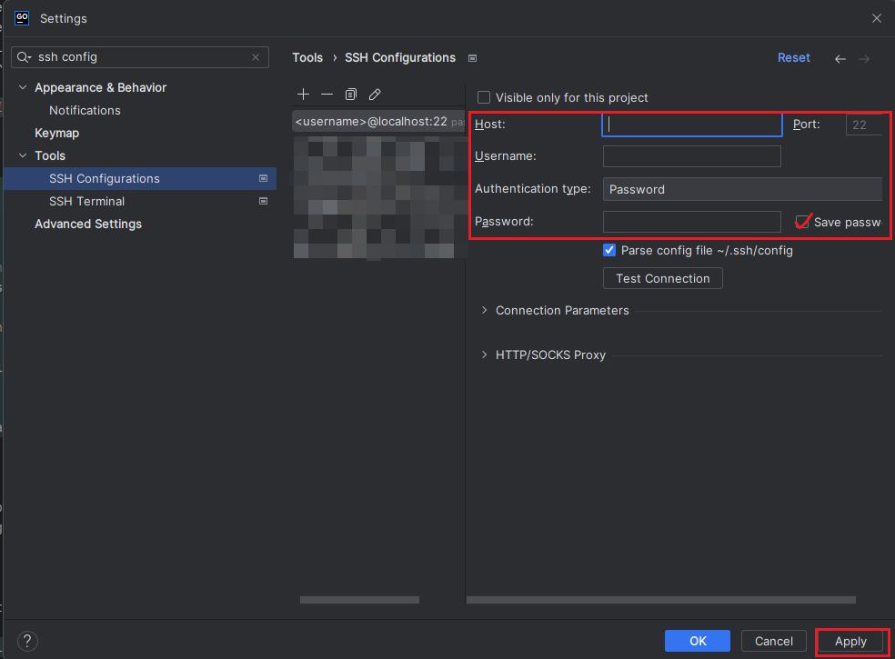
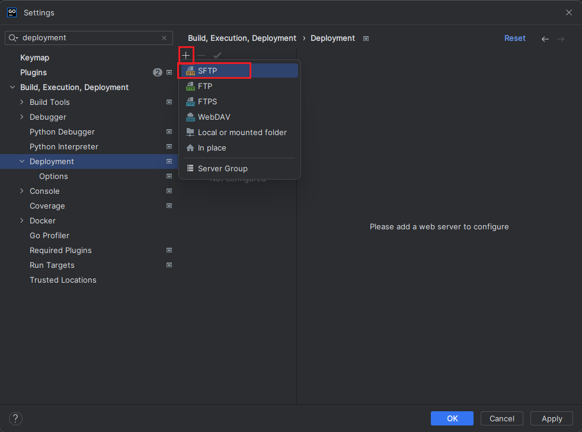
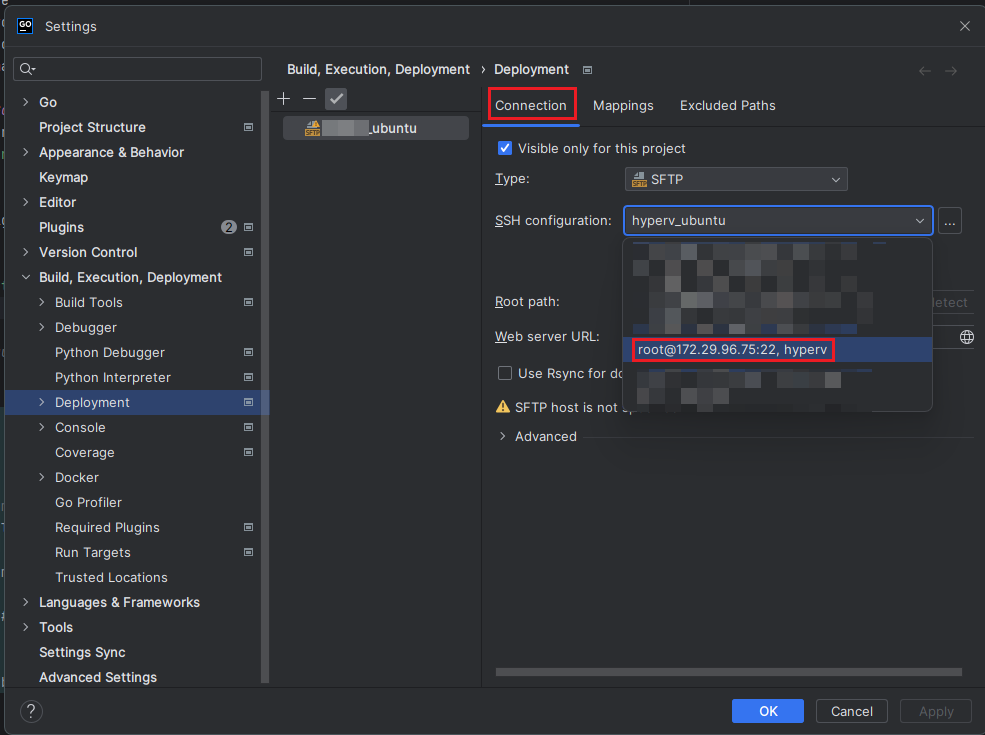
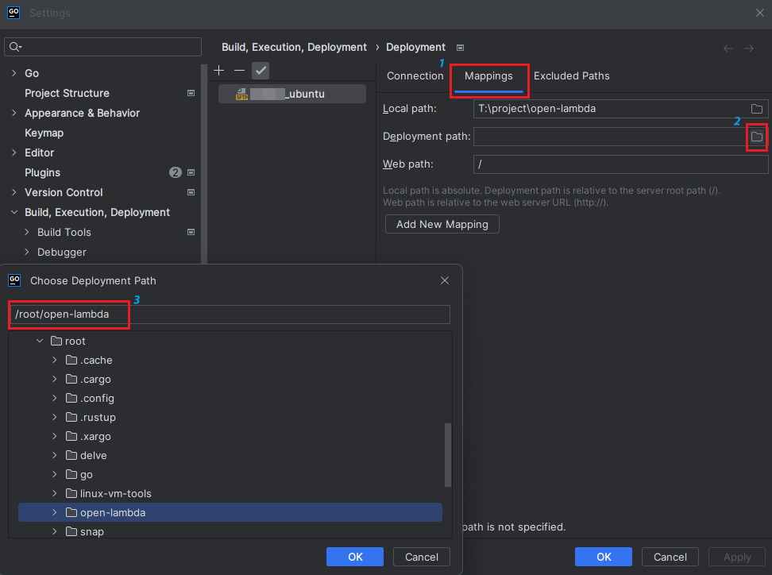
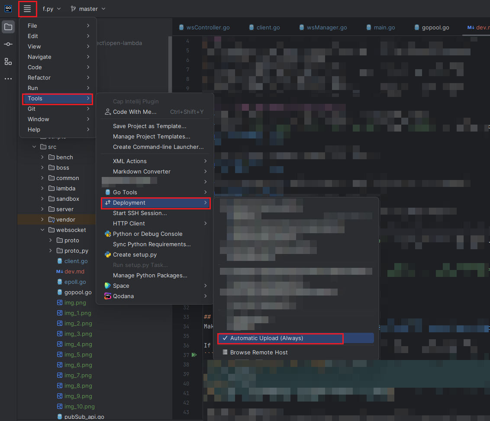
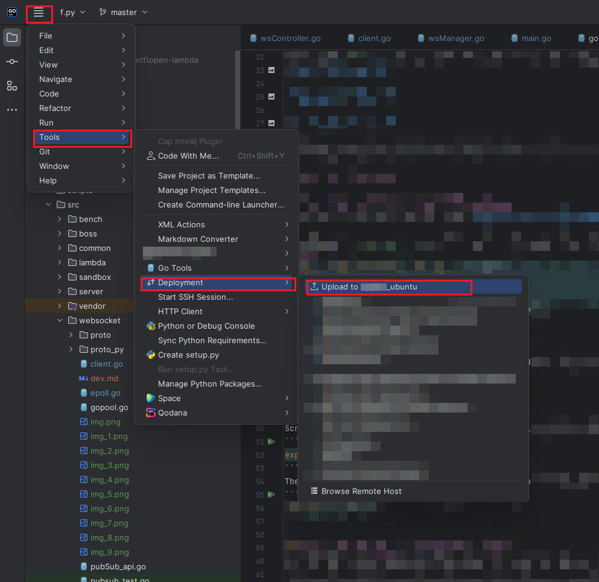
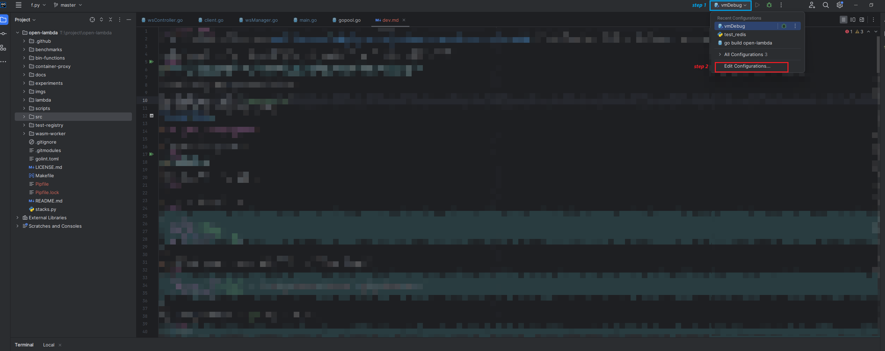
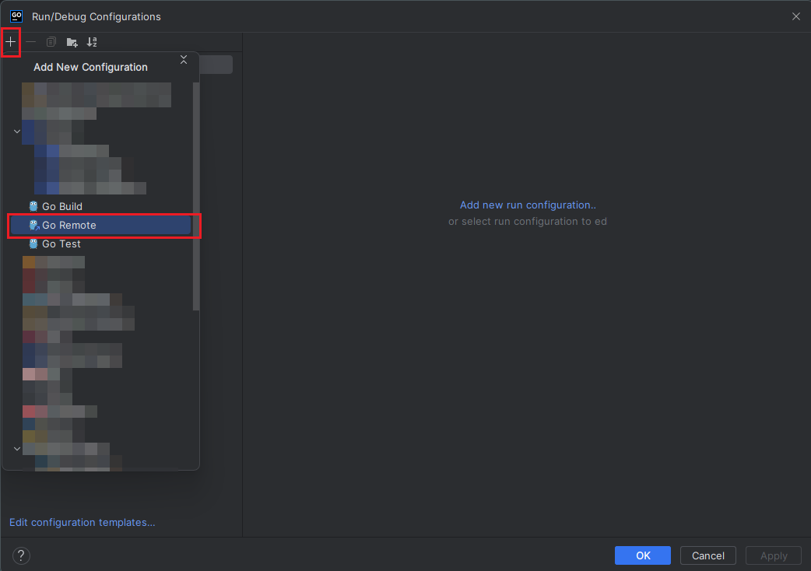
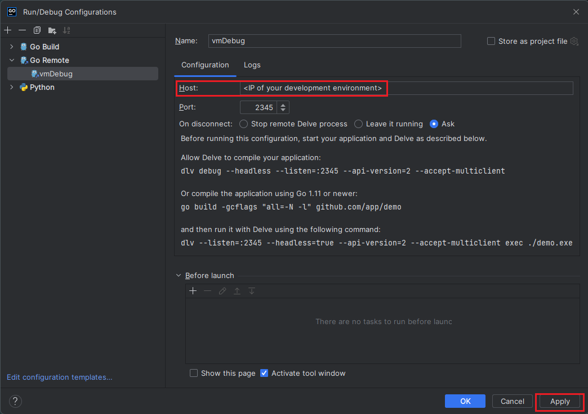
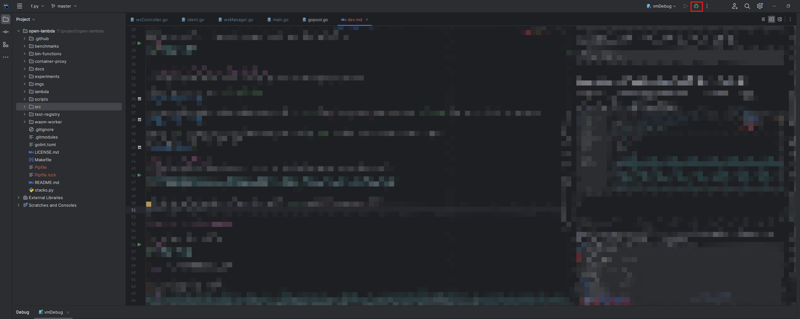

<!-- Trademark Notice -->
"Go" is a registered trademark of Google LLC, used here under nominative fair use for educational purposes.

"Python" and the Python logos are trademarks or registered trademarks of the Python Software Foundation, used here under nominative fair use for educational purposes.

Ubuntu and the Ubuntu logo are registered trademarks of Canonical Ltd., used here under permission for educational purposes. This material is intended solely for educational use and is not associated with or endorsed by Canonical Ltd.

Copyright © 2024 JetBrains s.r.o., used with permission. GoLand and the GoLand logo are registered trademarks of JetBrains s.r.o.

# Preparation
This document is a guide for developers to set up deployment and debug environment for OpenLambda worker.
I code in GoLand running on local desktop, and the OpenLambda worker runs on a remote machine. 
The code is automatically/manually deployed to the remote machine by GoLand.

My remote machine environment: Ubuntu 22.04, Go version go1.18.3 linux/amd64.

GoLand UI may varies, as I am using so-called `new UI` (you can find and switch to it in the settings), 
where logos might be different from the `classic UI`.
I am not sure if they still distinguish between the two UIs in the latest version of GoLand, the general logic should be the same.

Before setup auto deployment and debug, you are expected to finish the following steps:
1. Install go on the remote machine
2. Make sure ssh connection works between your local machine and the remote machine
3. Install GoLand on your local machine (use student email to get it for free)
4. Clone the repo to your remote machine and successfully build the project
5. Clone another repo in your local, open it in GoLand


# deploy

ctrl+alt+s(setting) -> Tools -> SSH Configurations -> add new configuration.
Fill in the `Host`, `Port`, `User name`, `Auth type`(`Password` or `key pair`) according to your remote machine's setup.



Then create a new deployment configuration (SFTP). 



In the SSH configuration column, choose the SSH connection you just created.



Fill in the `Mappings` according to your repo path in the remote machine.



click menu `Tools` -> `Deployment` -> `Automatic Upload` to enable auto deployment, or you can manually sync the files by right-clicking the files and choose `Deployment` -> `Upload to <your deployment name>`.



At the end, click menu `Tools` -> `Deployment` -> `Upload to <your deployment name>` to upload the whole project to the remote machine (you just need to do this once if the auto deployment is enabled).



# debug (using GoLand)

## step 1: install delve on the remote machine
Make sure you correctly install delve ([install instruction](https://github.com/go-delve/delve/tree/master/Documentation/installation)) in the remote machine and open the port 2345 for remote debugging.
delve version 1.20.2 should be compatible with go version 1.21.5 as installed in [getting-started.md](../worker/getting-started.md).

If running `dlv version` in the remote machine and you see something like this:
```bash
root@samuraiy-Virtual-Machine:~/go# dlv version
Delve Debugger
Version: 1.20.2
Build: $Id: e0c278ad8e0126a312b553b8e171e81bcbd37f60 $
``` 
then you are good to go.

else if command `dlv` is not found, you need to add the go binary path to the end of `/etc/profile` file.
To do so, run the following commands:
```bash
vi ~/.bashrc
```
Scroll down to the end of the file and add the following line, replace `go_env` with the result of `go env GOPATH`:
```bash
export PATH=$PATH:go_env/bin
```
Then save the file and run the following command to make the change take effect:
```bash
source ~/.bashrc
```

## step 2: set up debug configuration in GoLand
To debug the remote websocket server in GoLand, you need to set up Debug Configuration.

From the main menu, select `Run Configurations`.



Then you should see the following window popped up, click the `+` button on the top left corner and select `Go Remote`. Feel free to name the configuration.



Edit the `Host` according to your development environment. Set the `Port` to 2345, which is the default port of delve.
Don't forget to save the configuration.



## step 3: start debugging
To start debugging the OpenLambda worker, You may run the following command on the remote machine:
```bash
dlv --listen=:2345 --headless=true --api-version=2 --accept-multiclient exec ./ol -- worker up
```
`--` is used to separate Delve's command line arguments from those of the program being debugged.

At this time, the worker is not started yet. The code will not be executed until you start debugging in GoLand.
If you see the following output, 
```bash
API server listening at: [::]:2345
2023-05-21T22:38:21-05:00 warning layer=rpc Listening for remote connections (connections are not authenticated nor encrypted)
```
you are good to start debugging in GoLand by clicking the `Debug` button in the top right corner.




Feel free to set breakpoints in the code and start debugging!

# End
(Feel free to skip if you’re not in the mood for a tech rant.)

Compared to the common practice of using remote SSH with Visual Studio Code, GoLand offers several advantages in deployment and debugging.

1. **Redundancy for Resilience**: This scheme gives you two copies of your code—local and remote.
You’ll thank yourself for this backup plan someday.

2. **Embrace the Flexibility**: With GoLand, you have the freedom to design your workflow— auto-deploy your code, 
manually deploy to the remote, or even compare your local and remote versions before deciding what to keep.

3. **Less Network Jitter**: Unlike VSCode’s remote SSH, 
where you’re directly editing on the remote server and every network hiccup can cause delays or interruptions, 
GoLand keeps things local. 
This means your work isn’t constantly at the mercy of network stability, making for a smoother, more reliable experience.

4. **Resource trade-off**: GoLand uses more local memory (thanks to JVM), but it’s lighter on your remote server. 
It’s a trade-off I can live with.

Conclusion: forget about Visual Studio Code’s remote SSH (if you got enough memory).

