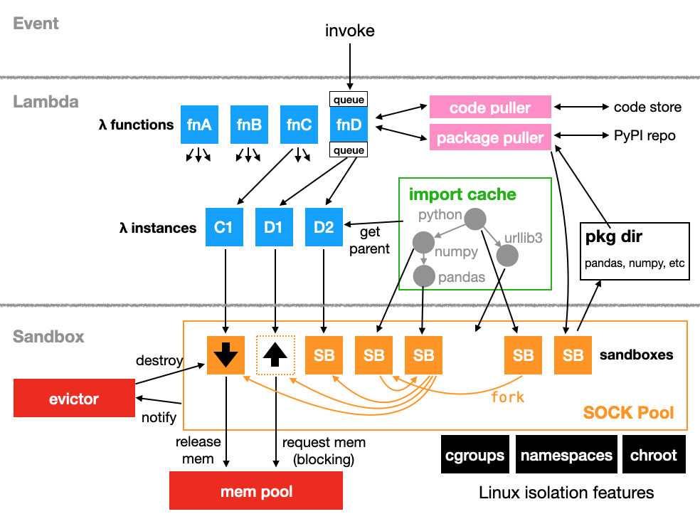

# OpenLambda Worker

## Deployment

See how to build the code, deploy a worker, and write/run lambdas [here](getting-started.md).

## Usage

* [base image](base-image.md)
* [dependency management](pypi-packages.md)
* [manual cleanup](manual-cleanup.md)
* [lambda configuration](lambda-config.md)
* registry config (TODO)
* Zygote tree (TODO)
* resource limits (TODO)

## Design

The following shows the major components of an OpenLambda worker:

The worker consists of three layers (from the bottom up): sandbox,
lambda, and event.

### 1. Sandbox

A sandboxing system (containers, VMs, etc) is necessary to isolate
lambda functions from each other in any serverless platform.  This is
a pluggable layer in OpenLambda -- different implementations can be
defined in github.com/open-lambda/open-lambda/ol/worker/server.

Very early on, OpenLambda used Docker containers for isolation.  Now,
the main implementation is SOCK (serverless-optimized
containers) -- the first version of this is described in [Oakes <i>et al.</i>](https://www.usenix.org/system/files/conference/atc18/atc18-oakes.pdf).

### 2. Lambda

The invocation of a lambda function occurs in a container, but it's
possible to have a lambda function with zero containers (or many
containers).  The lambda layer is in the
github.com/open-lambda/open-lambda/ol/worker/lambda package.

The two most important subsystems in this layer are the **lambda
function** and **lambda instance**.  A *lambda instance* is like a
robust virtual container and is backed by either 0 or 1 sandboxes.  A
lambda instance provisions a sandbox as needed and restarts it upon
failure.  When there are no incoming requests, the lambda instance is
responsible for pausing the backing container (if any).

The *lambda function* takes incoming requests and forwards them to
lambda instances.  A lambda function decides how many lambda instances
there should be based on number of queued requests and the average
invocation time.  The number of instances can be viewed as how many
containers the lambda function "wants" -- it might get fewer (if
memory is limited, it may not be possible to back every instance with
a container).

### 3. Event

Major cloud offerings (like AWS lambda) offer a variety of lambda
triggers, such as HTTP requests, queue messages, cron, DB/S3 triggers,
etc.

This has not been a focus (so far) of OpenLambda.  The only trigger is
an HTTP request.  Thus, all the event code is in the
github.com/open-lambda/open-lambda/ol/worker/server package.  Requests
to http(s)://WORKER_ADDR:PORT/run/LAMBDA_NAME invoke lambdas.
