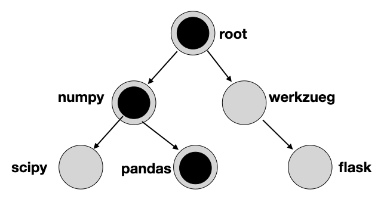

# Zygotes

A Zygote is a process that can be forked to create a new process.  The
Zygote generally does some pre-init, such as importing packages.  The
benefit of creating new processes from a Zygote is that the forked
children do not need to do the init work again.  Memory is
copy-on-write, and executable resources (loaded to memory by the
Zygote) generally don't change, so total memory footprint is smaller.

OpenLambda SOCK implement Zygote-based sandboxes (a SOCK sandbox can
be forked to create another SOCK sandbox).

Zygotes can be used to create other Sandboxes, so SOCK sandboxes form
trees.  Early on, these trees could take any shape at runtime.  Now, a
predefined shape is specified at launch.  During runtime, the Zygote
tree will correspond to a subset of that shape.

Example:



The gray boxes are Zygote nodes specified at launch, but the black
dots indicate actual sandboxes created during runtime, based on the
workload.

We hope to release a tool soon for automatically generating good
static trees based on traces.

For now, we include one default tree, specified in a JSON file.  After
initing a cluster, look at at "default-zygotes-40.json" inside the
worker directory.

Each node is a JSON object, with "packages" indicating what to
pre-import, and "children" specified child Zygotes to be created from
a parent Zygote.

By default, `import_cache_tree` in config.json specifies the path to
this default JSON file.  You can point it to a just JSON file you
create yourself, or even include JSON objects inline.

For example, this specifies 3 Zygotes: root is just Python interpreter
with no packages, child Zygote imports numpy, grandchild Zygote
imports pandas:

```json
  "import_cache_tree": {"packages": [],
                        "children": [
                          {"packages": ["numpy"],
                           "children": [
                             {"packages": ["pandas"],
                              "children": []}
                           ]
                          }
                        ]
                       },
```

Zygote implementation is pluggable.  In `import_cache` under
`features`, you can disable it (""), use a single tree ("tree"), or
use multiple trees ("multitree").

"tree" is the default.  "multitree" is added most recently, upon
observing workloads where many concurrent lamdas have the same package
requirements and thus need the same Zygote.  In such cases, that one
Zygote becomes a bottleneck.  "multitree" launchs many independant,
identical trees.  Every time a Zygote is needed, a tree is randomly
chosen to provide it.
